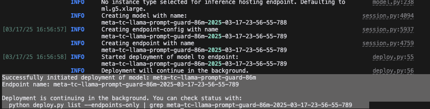
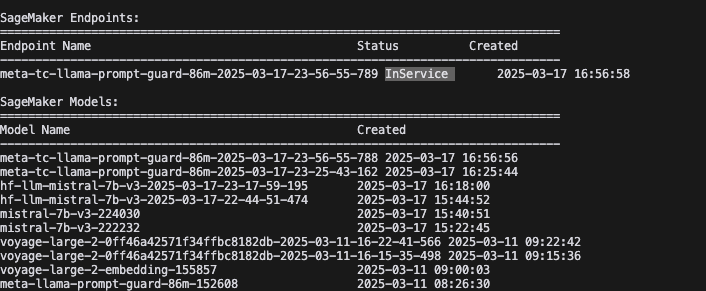

# 🚀 sagemaker-jumpstart-deployer

## 📥 Installation

1. Clone the repo
```bash
git clone https://github.com/jje-twl/sagemaker-jumpstart-deployer.git
```

2. Install the dependencies
```bash
pip install -r requirements.txt
```

3. Configure the AWS credentials to the account you want to deploy, list, and delete models from
```bash
aws configure
```


## 🧰 Usage

### ❓ Help & Options

```bash
# General help
python deploy.py --help

# Command-specific help
python deploy.py deploy --help
python deploy.py list --help
python deploy.py delete --help
```


### 🚀 Deploying a model 

```bash
# Deploy default model (Mistral 7B)
python deploy.py deploy

# Deploy a specific model
python deploy.py deploy --model-id meta-tc-llama-prompt-guard-86m

# Deploy with specific version
python deploy.py deploy --model-id meta-tc-llama-prompt-guard-86m --model-version "1.1.6"

# Deploy with a different instance type
python deploy.py deploy --instance-type ml.g5.4xlarge

# Deploy and wait for completion (not async)
python deploy.py deploy --wait
```

#### 📸 Deployment example output to console




### 📜 Listing Models and Endpoints


```bash
# List all models and endpoints
python deploy.py list

# List only endpoints
python deploy.py list --endpoints-only

# List only models
python deploy.py list --models-only

# Get JSON output
python deploy.py list --json
```

#### 📸 Listing models and endpoints output to console




### ❌ Deleting a models and endpoints

```bash
# Delete an endpoint (and its models)
python deploy.py delete --endpoint-name my-endpoint-name

# Delete endpoint but keep the model
python deploy.py delete --endpoint-name my-endpoint-name --keep-model
```

